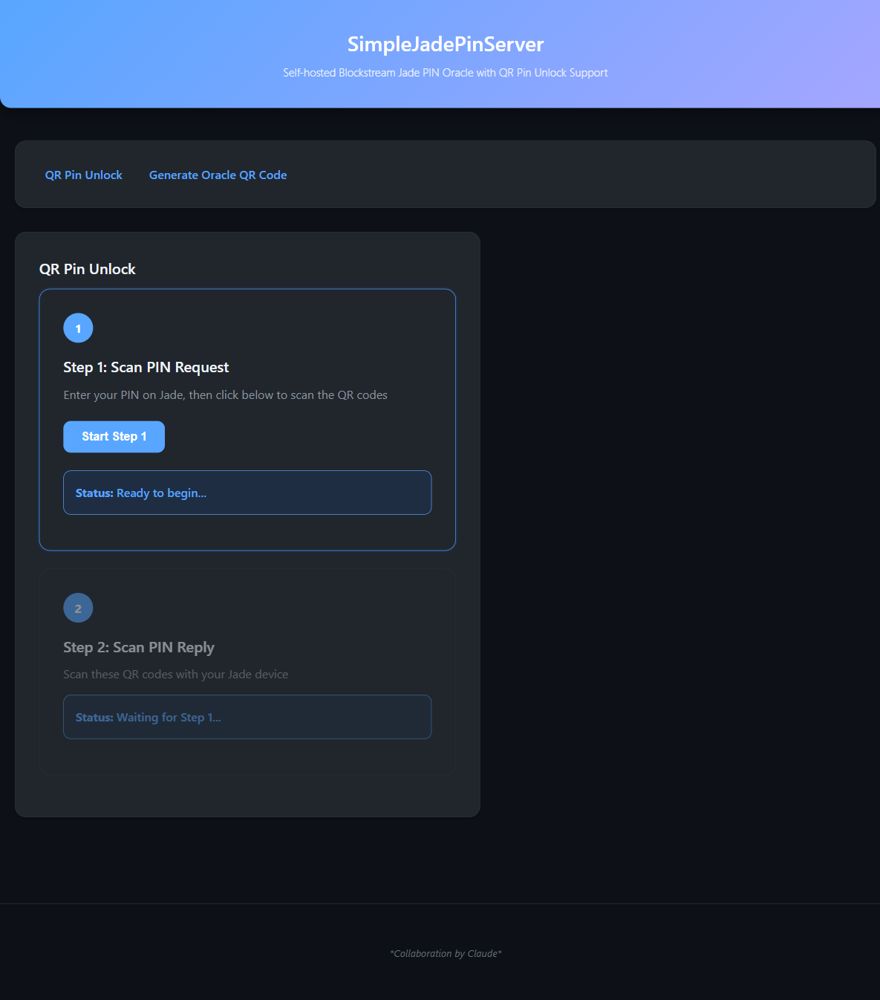
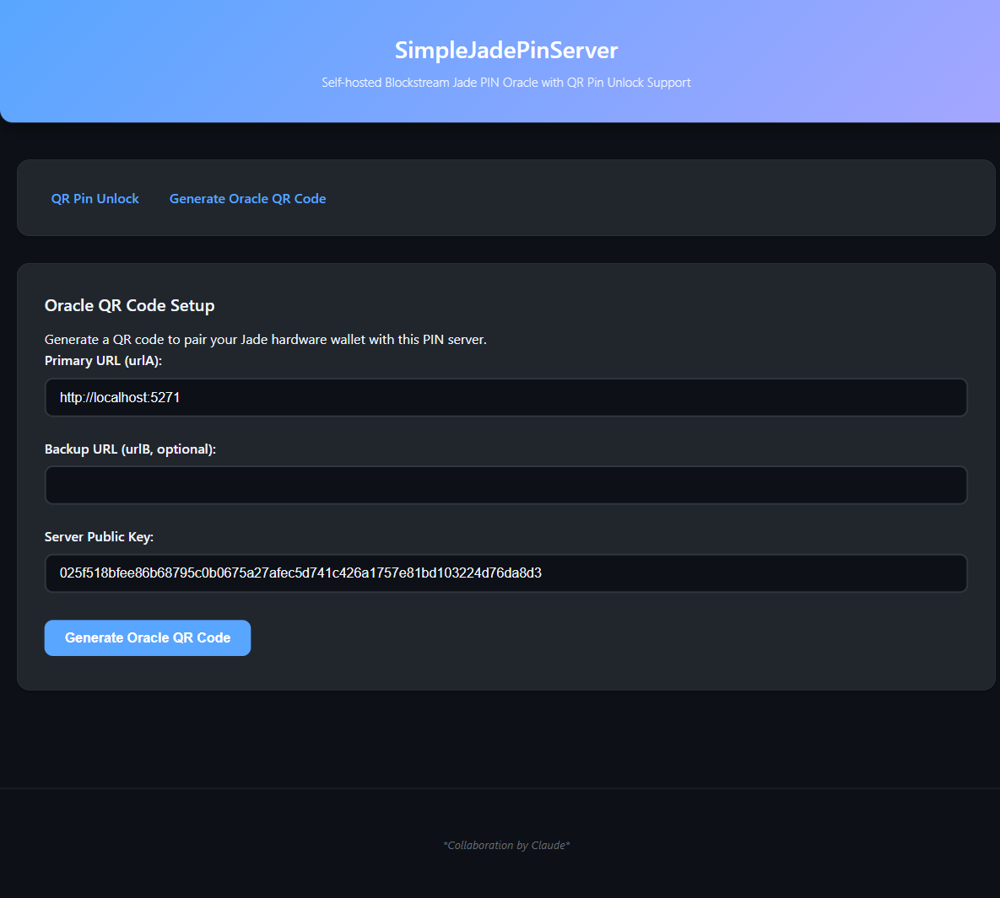
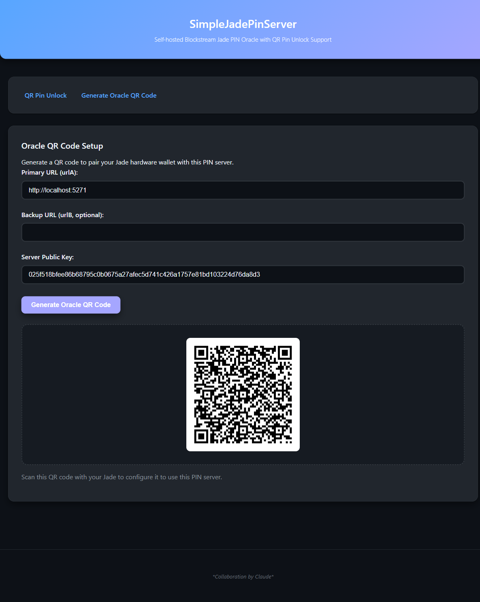

# SimpleJadePinServer.Blazor

A C# / Blazor Server port of [SimpleJadePinServer](https://github.com/Filiprogrammer/SimpleJadePinServer) by [Filiprogrammer](https://github.com/Filiprogrammer). All credit for the original design, protocol implementation, and web interface goes to the original author.

This is a self-hosted blind PIN oracle for the [Blockstream Jade](https://blockstream.com/jade/) hardware wallet, with support for QR Pin Unlock (air-gapped operation). It reimplements the same [blind oracle protocol](https://github.com/Blockstream/blind_pin_server) in C# using NBitcoin for cryptographic operations, verified against wallycore test vectors for compatibility.

> [!NOTE]
> This is a **clean-slate reimplementation** — PIN file storage is not compatible with the Python version. If you switch from the Python server, your Jade will need to be re-paired.

## Screenshots

### QR Pin Unlock


### Oracle QR Code Setup


### Generated Oracle QR Code


## Running with Docker

Create a `docker-compose.yml` (or use the [one included in this repo](docker-compose.yml)):

```yaml
services:
  simplejadepinserver:
    image: ghcr.io/bitcoin-self-custody/simplejadepinserver.blazor:latest
    ports:
      - "4443:8080"
    volumes:
      - ./key_data:/app/key_data
    restart: unless-stopped
```

```console
docker compose up -d
```

The web interface will be available at http://localhost:4443

On first run, a server keypair is automatically generated in `key_data/server_keys/`.

> [!TIP]
> The container runs without TLS. Use a reverse proxy like Caddy or NGINX if you need HTTPS for non-localhost access (required by browsers for camera permissions).

## Running with .NET (alternative)

Requires [.NET 9 SDK](https://dotnet.microsoft.com/download/dotnet/9.0) or later.

```console
cd src/SimpleJadePinServer.Blazor
dotnet run
```

The web interface will be available at http://localhost:5271

## Pairing your Jade

1. Navigate to the **Generate Oracle QR Code** page (`/oracle`)
2. The server public key is pre-filled; adjust the URL if needed
3. Click **Generate Oracle QR Code**
4. On your Jade, access the boot menu by clicking (not holding) the select button once while the logo appears
5. Select **Blind Oracle** → **Scan Oracle QR**
6. Scan the QR code displayed on screen and confirm on the Jade

> [!IMPORTANT]
> The Jade must be uninitialized to set a new blind oracle. If already set up, you'll need to factory reset and **restore using your recovery phrase — your wallet will be deleted. Funds will be lost without correct backup materials.**
>
> Source: [Blockstream Help](https://help.blockstream.com/hc/en-us/articles/12800132096793-Set-up-a-personal-blind-oracle)

> [!NOTE]
> If the Jade is used only in QR mode, the URL doesn't matter — only the server public key is important. However, firmware upgrades over USB/BLE require the URL to be correct and reachable. The Jade Plus supports air-gapped firmware upgrades via USB storage, so this limitation doesn't apply to it.

## Using QR Pin Unlock

Once your Jade is paired with this server:

### Step 1: Scan PIN Request

1. Enter your PIN on the Jade — it will display a series of BC-UR QR codes
2. On the web interface, click **Start Step 1**
3. Point your computer's camera at the Jade to scan the QR codes
4. The camera will automatically stop once all codes are captured

### Step 2: Display PIN Reply

1. Click **Start Step 2** — the server processes the PIN request and displays response QR codes
2. On the Jade, proceed to Step 2 and scan the QR codes from the screen

The wallet is now unlocked.

## Using with USB or Bluetooth

Once the Jade is configured with this server's oracle, it works normally with [Blockstream Green](https://blockstream.com/green/) over USB or Bluetooth. Green may warn about a non-default oracle on first connection — this can be dismissed via **Advanced** → **Don't ask me again for this oracle** → **Allow Non-Default Connection**.

## Project Structure

```
src/
├── SimpleJadePinServer.Blazor/           # Blazor Server web app
├── SimpleJadePinServer.Blazor.Crypto/    # BC-UR, Bytewords, CRC32, CBOR protocol
├── SimpleJadePinServer.Blazor.Services/  # KeyStorage, PinStorage, PinCrypto
└── SimpleJadePinServer.Blazor.Tests/     # xUnit tests (34 tests incl. wallycore vectors)
```

## Acknowledgements

- [Filiprogrammer](https://github.com/Filiprogrammer) — original [SimpleJadePinServer](https://github.com/Filiprogrammer/SimpleJadePinServer) design and implementation
- [Blockstream](https://github.com/Blockstream) — Jade hardware wallet and [blind_pin_server](https://github.com/Blockstream/blind_pin_server) protocol

*Collaboration by Claude*
